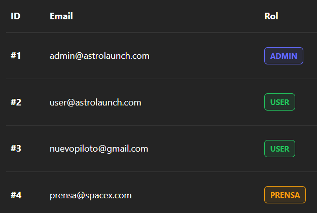

# AstroLaunchX 🚀

AstroLaunchX es una aplicación web interactiva desarrollada con **React** y **TypeScript** para el seguimiento de misiones espaciales de SpaceX. El proyecto integra datos reales mediante APIs, ofreciendo una experiencia de usuario fluida, moderna y adaptativa.

## 🛠️ Tecnologías Utilizadas

* **Core:** React (Vite), TypeScript.
* **Estilos:** CSS3 con variables nativas (CSS Variables) para gestión de temas.
* **Navegación:** React Router DOM.
* **Gestión de Estado y Lógica:** React Hooks nativos (useState, useEffect) y hooks de librerías (useForm, useParams).
* **Datos:** SpaceX API v4.

## ✨ Funcionalidades Principales

1.  **Listado de Misiones:** Visualización en grid de lanzamientos pasados y futuros.
2.  **Búsqueda y Filtrado:**
    * Búsqueda en tiempo real por nombre.
    * Filtrado por estado de la misión (Éxito/Fallo).
    * Ordenación cronológica (Ascendente/Descendente).
3.  **Vista de Detalle:** Información técnica del cohete, carga útil y mapa de la plataforma de lanzamiento.
4.  **Modo Oscuro/Claro:** Cambio de tema persistente y fluido.
5.  **Formulario de Contacto:** Validación robusta (Regex) y simulación de envío con feedback visual.
6.  **Diseño UX/UI:** Aplicación de leyes de la Gestalt (Proximidad, Semejanza, Feedback) y diseño totalmente responsive.

(Fase 2: Entorno Profesional)

AstroLaunchX ha evolucionado de una plataforma de consulta a un ecosistema profesional de monitorización y gestión de misiones espaciales. El proyecto ahora integra una arquitectura robusta orientada a la escalabilidad, seguridad y gestión jerárquica de usuarios.

## 🛠️ Tecnologías y Arquitectura

* **Core:** React (Vite), TypeScript.
* **Gestión de Estado Global:** Context API + `useReducer` para un flujo de datos unidireccional y predecible (Motor de Autenticación).
* **Arquitectura de Capas:** Separación estricta de responsabilidades (SRP) mediante una Capa de Servicios (`SpaceXAPI.ts` y `authApi.ts`).
* **Seguridad:** Autenticación basada en **JWT (JSON Web Tokens)** con persistencia en `localStorage`.
* **Despliegue:** Contenerización con **Docker** y **Docker Compose**.
* **Testing:** Suite de pruebas con **Vitest** y **React Testing Library**.

## ✨ Nuevas Funcionalidades

1.  **Gestión de Roles (RBAC):** Sistema jerárquico con niveles de acceso diferenciados para Administradores, Prensa y Pilotos.
2.  **Dashboards Reactivos:** Paneles de mando personalizados por rol con métricas en tiempo real (Tasas de éxito, conteo de tripulación, toneladas enviadas) utilizando un patrón simétrico de 4 tarjetas.
3.  **Filtrado Complejo de 4 Ejes:** Buscador avanzado que permite intersecciones lógicas (AND) entre Texto, Estado de misión, Tripulación y Orden cronológico.
4.  **Optimización Asíncrona:** Implementación de `Promise.all` para la carga en paralelo de datos técnicos (cohetes, plataformas, cargas útiles y tripulación), reduciendo drásticamente los tiempos de carga.
5.  **Seguridad UX:** Implementación de `rel="noopener noreferrer"` en todos los enlaces dinámicos externos para prevenir ataques de phishing.
6.  **Diseño Cognitivo:** Aplicación de la **Ley de la Proximidad (Gestalt)** para unificar visualmente la narrativa de "El Equipo" en las vistas de detalle.

## 🧪 Testing

La aplicación cuenta con una suite de **30 pruebas unitarias e integración** y **8 test E2E de flujos completos** que garantizan la estabilidad del sistema.  
Se han evaluado:  

* **Lógica de negocio:** Reducers puros y estados inmutables.
* **Mocks de API:** Simulación de escenarios de éxito y errores HTTP 401.

Para ejecutar las pruebas:
```bash
npm run test
```
**Testing funcional E2E**

En la base de datos ya estan definidos los usuarios que hacen falta para ejcutar estos test exitosamente, en caso de duda consultar db.json.  


    
  
Para ejecutar test E2E:
```bash
npx playwright test --ui
```

## 📦 Instalación y Desarrollo Local

1.  Clonar el repositorio y entrar en la carpeta del proyecto: `git clone https://github.com/Mig1881/Astro-launch.git`  
2.  Entrar en la carpeta del proyecto: `cd Astro-launch`
3.  Instalar dependencias: `npm install`
4.  Arranacar el servidor del backend: `node server/server.ts`
5.  Ejecutar en desarrollo: `npm run dev`

## 📦 Despliegue en Produccion (AWS EC2 + Docker)

1. Configuración del Entorno. En el terminal de la EC2 escribe: 

```bash
git clone https://github.com/Mig1881/Astro-launch
cd Astro-launch
```

Es obligatorio crear un archivo .env en la raíz del proyecto para configurar la comunicación entre el Frontend y el Backend. Este archivo debe contener las siguientes tres variables:

```bash
nano .env
```

```bash
HOST_IP=TU_IP_PUBLICA_AWS   # (localhost en local, IP pública en AWS)
PORT=3000                   # Puerto donde correrá el Backend
JWT_SECRET=tu_clave_secreta # Clave para la firma de tokens
```
guarda con Ctrl+O, Enter, y sale con Ctrl+X

3. Construir las imágenes: 
```bash
sudo docker compose build --no-cache
```
4. Levantar los contenedores:
```bash
sudo docker compose up -d
```


